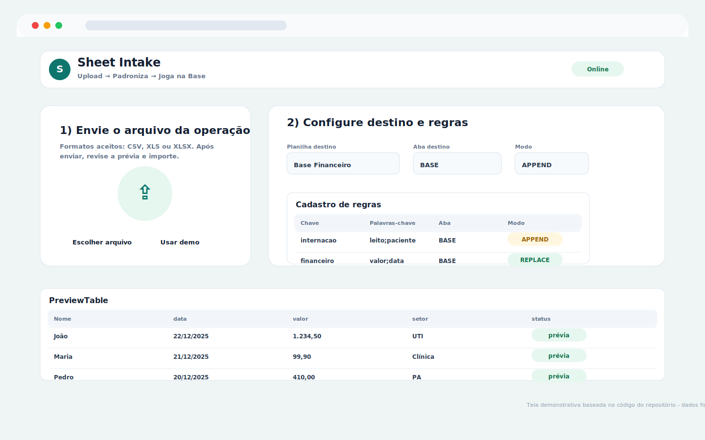
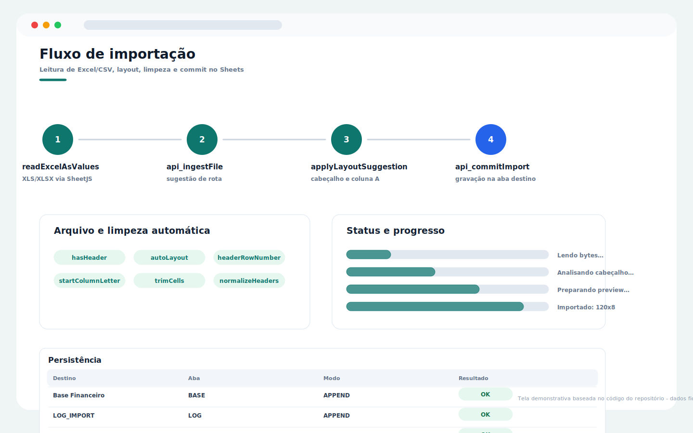

# Google Sheets Automation Tool

Google Sheets automation tool built with JavaScript and Google Apps Script to improve productivity.

## Overview

This project was developed to solve real operational problems using web technologies and Google Workspace tools.

## Features

- Dashboard interface
- Process automation
- Data organization
- KPI monitoring
- Responsive design
- Google Workspace integration

## Technologies

- JavaScript
- HTML
- CSS
- Google Apps Script
- Google Sheets
- Looker Studio

## Purpose

The goal of this project is to improve operational efficiency, reduce manual work, and support better decision-making through automation and clear data visualization.

## Guia visual do sistema

> Telas demonstrativas baseadas nos componentes, textos, cores e fluxos encontrados no código deste repositório. Os dados exibidos são fictícios e não representam pacientes, profissionais ou instituições reais.

### Sheet Intake - upload e regras

### Sheet Intake - fluxo de importação

## Status

In development
